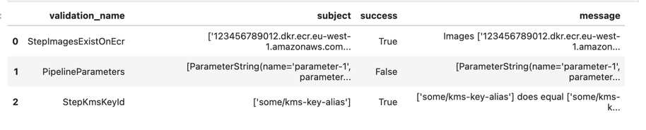

[](https://codecov.io/gh/stiebels/sagemaker-rightline)
[](https://github.com/stiebels/sagemaker-rightline/issues)

# sagemaker-rightline

This repository contains the source code for sagemaker-rightline, a Python package that eases validation of properties of a SageMaker Pipeline object.

Note that at present this package is in an early stage of development and is not yet ready for production use. We welcome contributions!


## README Content

- [Features](#features)
- [Usage](#usage)
- [Contributing](#contributing)

## Features

### ⚙️ Configuration
The `Configuration` class is responsible for running the `Validations` against the `Pipeline` object and returning a `Report`.
The `Configuration` class is instantiated with a
 - `sagemaker.workflow.pipeline.Pipeline` object, and
 - a list of `Validations`.

### ✔️ Validations
A `Validation` is a class that inherits from the `Validation` base class.
It is responsible for validating a single property of the `Pipeline` object.
We differentiate between `Validations` that check the `Pipeline` object itself (class names beginning with "Pipeline") and `Validations` that check the `Pipeline` object's `Step` objects (class name starting with "Step").
Depending on the specific `Validation`, a different set of `StepTypEnums` may be supported.

For example, the `StepImagesExist` supports `Processing` and `Training` steps. It's a validation checks that all ImageURI that
Steps of the named types of the `Pipeline` object reference indeed exist on the target ECR.

The following `Validations` are currently implemented:
  - `PipelineParametersAsExpected`
  - `StepImagesExist`
  - `StepKmsKeyIdAsExpected`
  - `StepNetworkConfigAsExpected`
  - `StepLambdaFunctionExists`
  - `StepRoleNameExists`
  - `StepRoleNameAsExpected`
  - `StepTagsAsExpected`
  - `StepInputsAsExpected`
  - `StepOutputsAsExpected`
  - `StepInputOutputAsExpected`

In most cases, a `Validation` subclass requires passing a `Rule` object to its constructor.

### 📜 Rules
A `Rule` is a class that inherits from the `Rule` base class.
It is responsible for defining the rule that a `Validation` checks for.
For example, passing the list of expected KMSKeyIDs and the `Rule` `Equals` to `StepKmsKeyIdAsExpected` will check that
all `Step` objects of the `Pipeline` object have a `KmsKeyId` property that matches the passed KMSKeyIDs.

Note that not all `Validations` require a `Rule` object, e.g. `StepImagesExist`.

The following `Rules` are currently implemented:
  - `Equals`
  - `Contains`

All rules support the `negative` parameter (default: `False`), which allows for inverting the rule.

### 📝 Report
A `Report` is a class whose instance is returned by the `Configuration` class (optionally a pandas.DataFrame instead).
It contains the results of the `Validations` that were run against the `Pipeline` object as well as additional information
to allow for further analysis.

## Usage

```python
from sagemaker.processing import NetworkConfig, ProcessingInput, ProcessingOutput
from sagemaker.workflow.parameters import ParameterString
from sagemaker_rightline.model import Configuration
from sagemaker_rightline.rules import Contains, Equals
from sagemaker_rightline.validations import (
    PipelineParametersAsExpected,
    StepImagesExist,
    StepKmsKeyIdAsExpected,
    StepNetworkConfigAsExpected,
    StepLambdaFunctionExists,
    StepRoleNameExists,
    StepRoleNameAsExpected,
    StepTagsAsExpected,
    StepInputsAsExpected,
    StepOutputsAsExpected,
    StepOutputsMatchInputsAsExpected,
)

# Import a dummy pipeline
from tests.fixtures.pipeline import get_sagemaker_pipeline, DUMMY_BUCKET

sm_pipeline = get_sagemaker_pipeline()

# Define Validations
validations = [
    StepImagesExist(),
    PipelineParametersAsExpected(
        parameters_expected=[
            ParameterString(
                name="parameter-1",
                default_value="some-value",
            ),
        ],
        rule=Contains(),
    ),
    StepKmsKeyIdAsExpected(
        kms_key_id_expected="some/kms-key-alias",
        step_name="sm_training_step_sklearn",  # optional: if not set, will check all steps
        rule=Equals(),
    ),
    StepNetworkConfigAsExpected(
        network_config_expected=NetworkConfig(
            enable_network_isolation=False,
            security_group_ids=["sg-1234567890"],
            subnets=["subnet-1234567890"],
        ),
        rule=Equals(negative=True),
    ),
    StepLambdaFunctionExists(),
    StepRoleNameExists(),
    StepRoleNameAsExpected(
        role_name_expected="some-role-name",
        step_name="sm_training_step_sklearn",  # optional: if not set, will check all steps
        rule=Equals(),
    ),
    StepTagsAsExpected(
        tags_expected=[{
            "some-key": "some-value",
        }],
        step_name="sm_training_step_sklearn",  # optional: if not set, will check all steps
        rule=Equals(),
    ),
    StepInputsAsExpected(
        inputs_expected=[
            ProcessingInput(
                source=f"s3://{DUMMY_BUCKET}/input-1",
                destination="/opt/ml/processing/input",
                input_name="input-2",
            )
        ],
        step_type="Processing",  # either step_type or step_name must be set to filter
        rule=Contains(),
    ),
    StepOutputsAsExpected(
        outputs_expected=[
            ProcessingOutput(
                source="/opt/ml/processing/output",
                destination=f"s3://{DUMMY_BUCKET}/output-1",
                output_name="output-1",
            )
        ],
        step_name="sm_processing_step_spark",  # optional
        rule=Contains(),
    ),
    StepOutputsMatchInputsAsExpected(
        inputs_outputs_expected=[
            {
                "input": {
                    "step_name": "sm_processing_step_sklearn",
                    "input_name": "input-1",
                },
                "output": {
                    "step_name": "sm_processing_step_sklearn",
                    "output_name": "output-1",
                },
            }
        ]
    ),
]

# Add Validations and SageMaker Pipeline to Configuration
cm = Configuration(
    validations=validations,
    sagemaker_pipeline=sm_pipeline,
)

# Run the full Configuration
df = cm.run()

# Show the report
df
```


## Release
Publishing a new version to PyPI is done via the `Release` functionality.
This will trigger the `publish.yml` workflow, creating a new release with the version from the tag and publish the package to PyPI.

## Contributing
Contributions welcome! We'll add a guide shortly.
